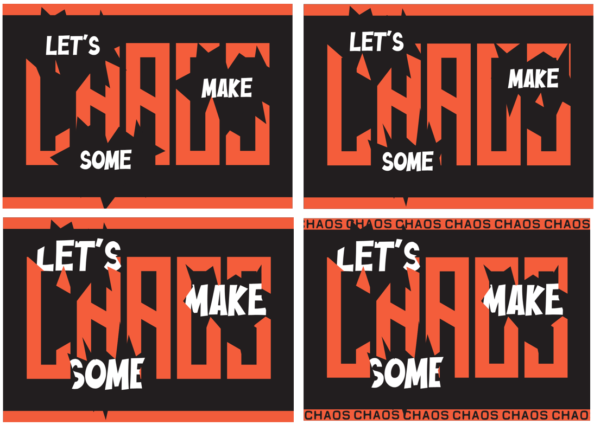

+++
draft = false
image = "img/portfolio/Final-Product-Mock-Up.gif"
showonlyimage = false
date = "2016-11-05T19:50:47+05:30"
title = "LET'S MAKE SOME CHAOS - Typography Project"
weight = 3
+++

I designed a typography poster for a chosen quote, the chosen quote being 'Let's make some chaos'. I explored my designs with Adobe Photoshop, Adobe Illustrator and Adobe After Effects.
<!--more-->

## Typography Poster Process
#### Initial Ideas

#### Developments Through Changes

#### Refinements

#### Final
